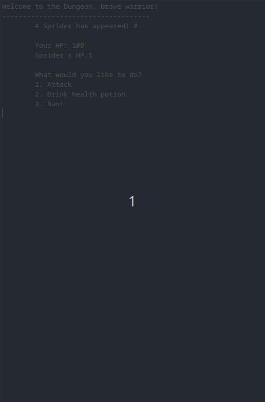

# Text Adventure Game

This is a text-based adventure game written in Java.

## Plot

You are a brave warrior and you find yourself in a dungeon full of enemies that can't wait to kill you! Kill as many as you can, without dying.

## How to play

As a player you have 3 options. To select an option simply type the number corresponding to it. The options are as follows:

1. Attack: You strike the enemy for a random amount of damage and receive a random amount in return.
2. Drink health potion: Drink a potion that restores your health by a random amount.
3. Run!: You run away from the enemy and face a new one.

## Features

- Enemies have a random chance of dropping health potions.
- Experience points are awarded for killing enemies. 
- Player levels up after collecting a certain amount of experience points. 

## How to launch the game

1. Make sure you have Java JDK installed.
2. Clone the code: https://github.com/georgia-koukoutou/text-based-adventure-game.git
3. Open the game directory with `cd text-based-adventure-game`.
4. Compile the game with `mvn clean package`.
4. Run the game using `java -jar target/textgame.jar `.
3. Enjoy the game!

## Game demo

